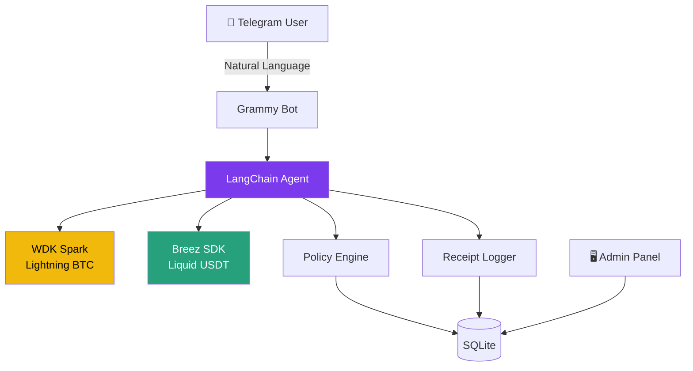

# ⚡ sats.fast

> Self-hosted Telegram bot — your personal Bitcoin financial agent.

Chat in plain English. Send and receive Bitcoin and USDT. No wallet expertise required.

[](LICENSE)
[](https://nodejs.org)
[](https://github.com/nickthetechnerd/wdk-docs)
[](#)

## What is this?

sats.fast is a Telegram bot that understands natural language and executes real Bitcoin transactions. It's like having a personal financial agent in your pocket.

**Example conversation:**

```
You:  What's my balance?
Bot:  ⚡ Lightning BTC (Spark)
      Balance: 0.00150000 BTC (150,000 sats)
      ≈ $90.00 USD

      💵 Liquid USDT
      Balance: 25.00 USDT

You:  Send 5000 sats to spark1abc...
Bot:  💸 Confirm payment?
      To:      spark1abc...
      Amount:  5,000 sats (~$3.00)
      Fee:     0 sats (Spark)
      [✓ Confirm]  [✗ Cancel]

You:  Don't ask me next time under 5000 sats
Bot:  ✅ Auto-approve threshold updated to 5,000 sats.
```

## Architecture



### Two Wallets, One Seed

| Wallet | SDK | What it handles | Fees |
|--------|-----|----------------|------|
| ⚡ Lightning BTC | `@tetherto/wdk-wallet-spark` | Lightning invoices, Spark addresses, L1 deposits | **0 sats** (Spark) |
| 💵 Liquid USDT | `@breeztech/breez-sdk-liquid` | USDT on Liquid network | Network fees (shown before confirm) |

Both wallets derive from the **same BIP-39 mnemonic**. One seed phrase backs up everything.

## Quick Start

### One-Command Install (VPS)

```bash
curl -sSL https://raw.githubusercontent.com/pseudozach/sats.fast/main/scripts/install.sh | bash
```

Targets Ubuntu 22.04 / Debian 12. Installs Node.js 22, pnpm, pm2, nginx.

### Manual Setup

```bash
# Clone
git clone https://github.com/pseudozach/sats.fast.git
cd sats-fast

# Install
pnpm install
pnpm build

# Configure
cp .env.example .env
# Edit .env with your values

# Database
pnpm db:migrate

# Run
pnpm dev:bot    # Telegram bot
pnpm dev:admin  # Admin panel on :3000
```

## Prerequisites

### Required Keys

| Key | Where to get it | Cost |
|-----|----------------|------|
| `TELEGRAM_BOT_TOKEN` | [@BotFather](https://t.me/BotFather) | Free |
| `BREEZ_API_KEY` | [breez.technology/request-api-key](https://breez.technology/request-api-key/#contact-us-form-sdk) | Free |
| `MASTER_ENCRYPTION_KEY` | `openssl rand -hex 32` | Generate locally |
| OpenAI or Anthropic key | User provides their own | User pays |

### System Requirements

- **Node.js v22+** (required by Breez SDK)
- **pnpm** (package manager)
- **SQLite** (database)
- 512 MB RAM minimum
- Any Linux VPS ($5/mo works fine)

## Bot Commands

| Command | Description |
|---------|-------------|
| `/start` | Create wallet, onboard |
| `/balance` | Show both balances |
| `/deposit` | Get BTC deposit address |
| `/invoice <amt>` | Create Lightning invoice |
| `/pay <bolt11>` | Pay Lightning invoice |
| `/send <addr> <amt>` | Send BTC or USDT |
| `/receive` | Get Liquid USDT address |
| `/history` | Recent transactions |
| `/limits` | View spending limits |
| `/setlimit <type> <amt>` | Update a limit |
| `/exportkey` | Export seed phrase (DM) |
| `/setprovider` | Switch AI provider |
| `/setkey <key>` | Set AI API key |

Or just type naturally: *"Send 10 dollars to..."*

## Project Structure

```
sats-fast/
├── apps/
│   ├── bot/           # Grammy Telegram bot
│   └── admin/         # Express + EJS admin panel
├── packages/
│   ├── agent/         # LangChain agent + tools
│   ├── wallet-spark/  # WDK Spark adapter (Lightning BTC)
│   ├── wallet-liquid/ # Breez SDK adapter (USDT)
│   ├── policy/        # Spend limits, auto-approve
│   ├── receipts/      # Transaction receipts + audit
│   └── shared/        # DB schema, crypto, types
├── scripts/
│   └── install.sh     # One-command VPS installer
└── docs/
```

## Security

- Seeds encrypted with AES-256-GCM at rest
- Per-user spending limits and approval flows
- Admin panel with session auth
- API keys encrypted in database
- Self-custodial: users own their keys

⚠️ **Demo-grade security.** For production, add HSM key management, rate limiting, and proper authentication.

## License

MIT

## Hackathon

Built for the **Tether WDK Hackathon Galactica** — Agent Wallets track.

See [HACKATHON_FIT.md](docs/HACKATHON_FIT.md) for how this maps to track requirements.
